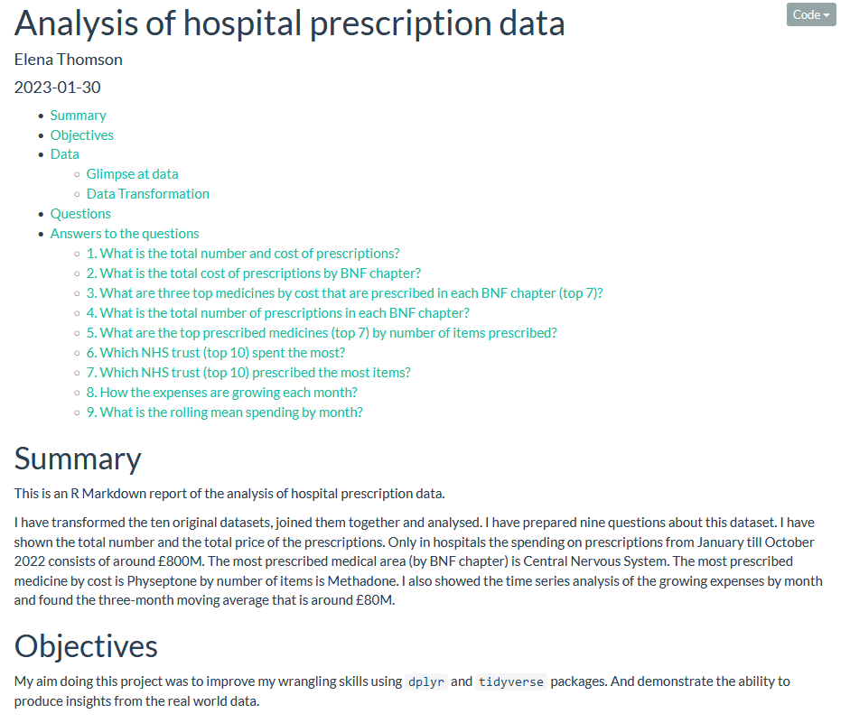

# Prescriptions
In this repository I showcase my analysis of the prescription data.

My aim doing this project was to improve my wrangling skills using `dplyr` and `tidyverse` packages. And demonstrate the ability to produce insights from the real world data.

Data comes from NHS Business Service Authority (NHSBSA) [ Here is the link ](https://www.nhsbsa.nhs.uk/prescription-data/prescribing-data/hospital-prescribing-dispensed-community) where more information can be found. 

The link to download actual data is [ here ](https://opendata.nhsbsa.net/dataset/hospital-prescribing-dispensed-in-the-community)

If you want to reproduce the analysis please download the final version of [ the file ](https://drive.google.com/file/d/1xUDaPpq0XzBzB9xJ86J1l_gBp5Mahqw4/view?usp=share_link) from google drive and put it to the 00_data folder and knit the rmd file.

The data provided is based on England Hospital Trust prescribing only and includes prescription items which were prescribed in England and dispensed in the community in England as well as in Wales, Scotland, and the Isle of Man.

It is a monthly dataset. The data was downloaded in December 2022. The datasets available at the time were from January to October 2022.

The preview of the report is below and the report can be seen [ here ](https://elenathomson.github.io/Prescriptions)
The [ code ](Report_prescriptions.Rmd) is also available as rmd file.

